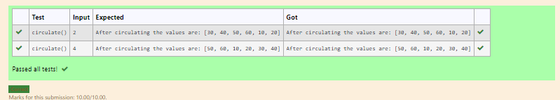

# Circulate-the-values-of-N-variables
## Aim:
To write a python program to circulate the n variables using function concept
## Equipment’s required:
PC
Anaconda - Python 3.7
## Algorithm: 
### Step 1:
Use function circulate
### Step 2:
Prepare the list
### Step 3: 
Get the value from the user for the number of rotation
### Step 4: 
Using the slicing concept rotate the list
### Step 5: 
Print both values and get the result
### Step 6:
End the Program 
## PROGRAM
```
def circulate():
    l=[10,20,30,40,50,60]
    n=int(input())
    a=l[n:]+l[:n]
    print("After circulating the values are:",a)
```    

## Output:



## Result:

Thus circulate the n variables using function concept is successfully executed
